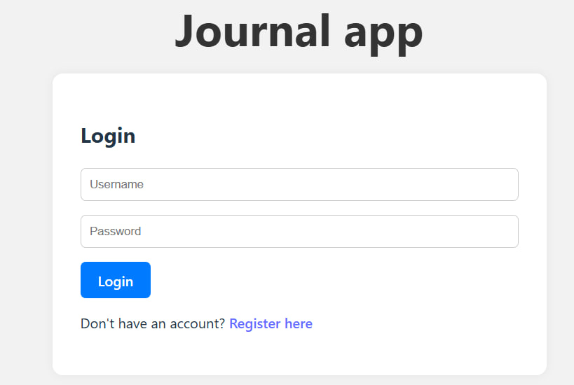
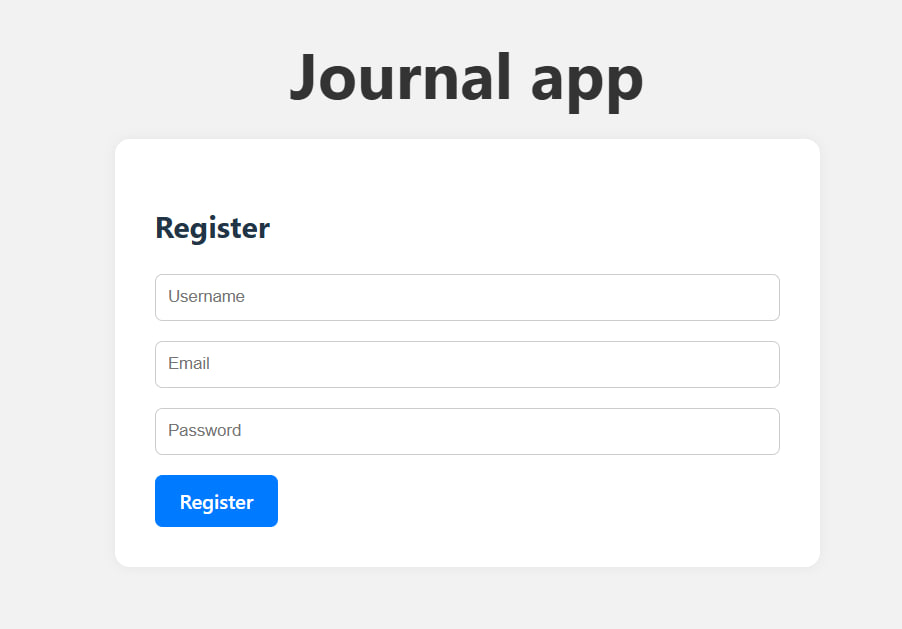
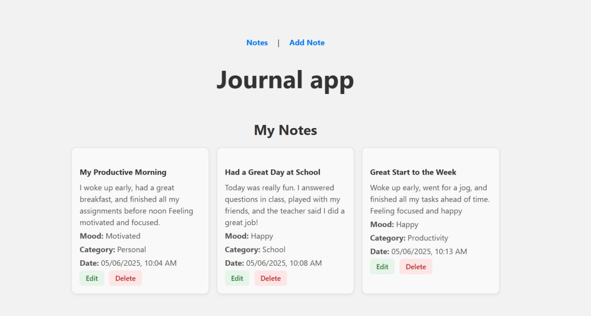
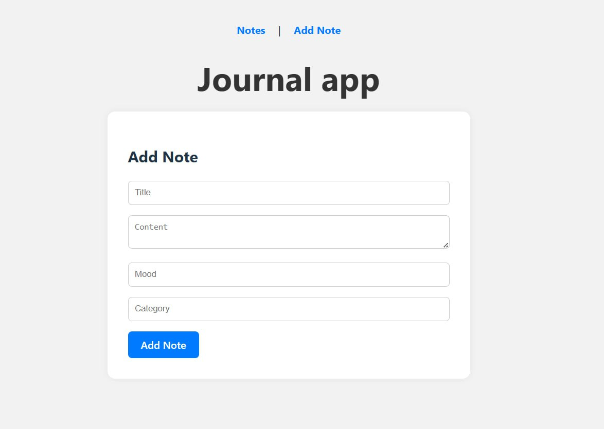

# Journal App

Journal App, a personal journaling application where users can register, log in, and create, edit, and delete notes with moods and categories. The app is built using React and communicates with a Django backend.


## Backend Repository
[Backend Repository Link] (https://github.com/ReemAlharbi2/Journal-App-backend.git)

## Tech Stack
- **React**
- **React Router**
- **Django**
- **PostgreSQL**
- **JavaScript**
- **Axios**
- **JWT Authentication**

## IceBox Features

These are potential features that may be added in the future to enhance user experience:

- Dark Mode Support: Allow users to switch between light and dark themes.
- Search and Filter Notes: Enable users to search notes and filter them by mood or category.
- Favorite/Pin Notes: Let users mark important notes as favorites or pin them to the top.
- Log out

## Screenshots of the Flow of the App






## Installation Instructions
```bash
git clone https://github.com/ReemAlharbi2/Journal-App-frontend.git
cd Journal-App-frontend
npm install
npm run dev

```

